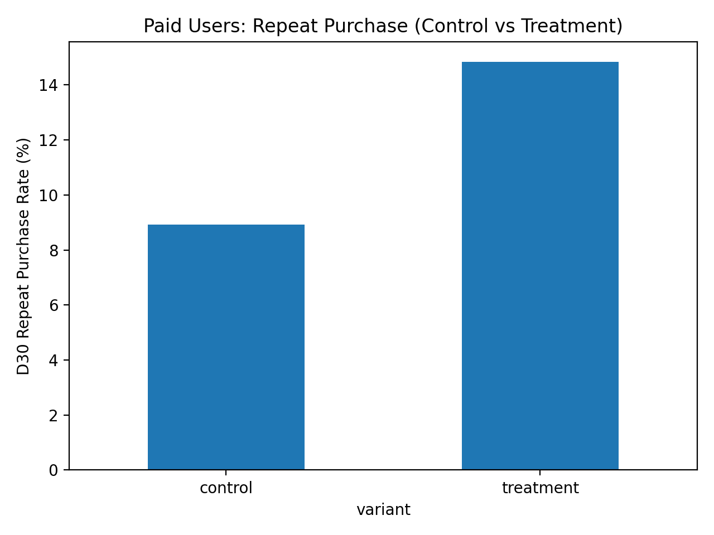
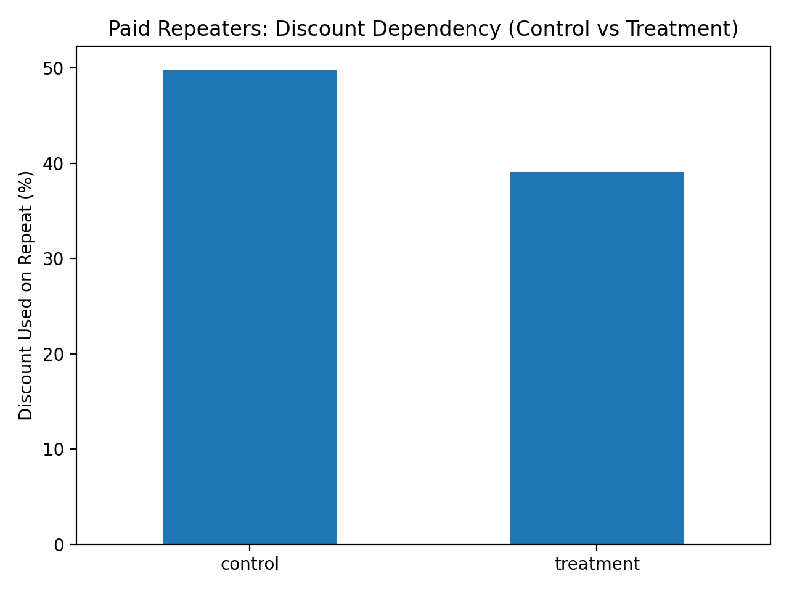
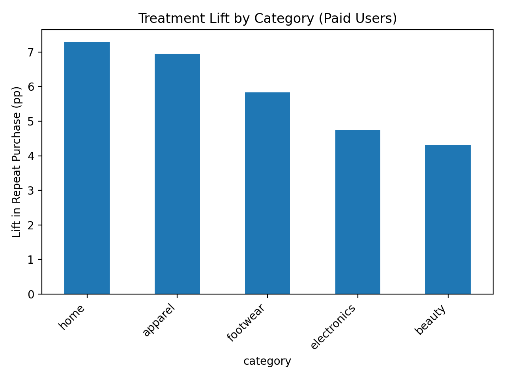
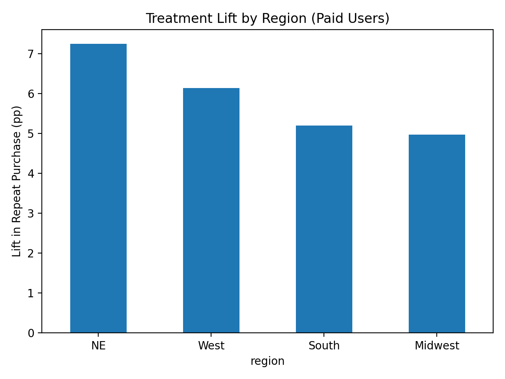

**🧪 Improving Repeat Purchase for Paid-Acquisition Users using Post-Purchase UGC**

A Retail A/B Testing Case Study

**📌 Overview**

Paid-acquisition users in retail apps often convert on their first purchase but fail to return, leading to low retention and heavy reliance on discounts. This project investigates whether post-purchase confidence reinforcement using authentic user-generated content (UGC) can improve repeat purchase behavior without increasing promotions or harming customer experience.

Using a controlled A/B experiment, we test a non-monetary retention lever targeted specifically at paid-acquisition users and evaluate its impact across retention, margin proxies, and customer quality metrics.

**❓ Problem Statement**

Retail teams observed a persistent gap in D30 repeat purchase between:

Paid-acquisition users (lower retention, higher discount dependency)

Organic users (higher trust, stronger repeat behavior)

Key question:

Is paid user churn driven by poor acquisition quality — or by lack of post-purchase confidence and trust?

**💡 Hypothesis**

Providing authentic social proof after delivery (via UGC) will reduce buyer’s remorse and increase repeat purchase among paid-acquisition users, without increasing returns or discount dependency.

**🧪 Experiment Design**
Population

First-time purchasers acquired via paid channels

Organic users used only as a benchmark (not randomized)

Variants

Control:
Order confirmation + shipping emails only

Treatment:
Control emails plus a UGC confidence email sent 5–7 days after delivery, showing how real customers use or style the product

Why post-delivery?

This timing aligns with:

Initial product usage

Peak buyer’s remorse window

Return decision period

**📏 Metrics & Measurement Strategy**
Primary Metric

D30 Repeat Purchase Rate
Measures relationship formation beyond the first transaction

Secondary Metrics

Time to next purchase (natural vs forced repeats)

Repeat order value (quality of repeat behavior)

Discount usage on repeat (margin dependency proxy)

Guardrails

Return rate (expectation mismatch)

Email engagement (diagnostic only)

**📈 Outcome Snapshot**
Primary Impact (Paid Users)

Repeat Purchase (D30)

Control: 8.9%

Treatment: 14.8%

+5.9 pp lift (+66%)

p < 0.001, 95% CI: [+4.8 pp, +7.1 pp]

Quality & Risk Checks

Return rate: No significant increase

Repeat order value: Stable

Time to next purchase: No forced urgency

Margin Signal

Discount usage on repeat

Control: 49.8%

Treatment: 39.1%

–10.7 pp reduction (p < 0.001)

## 📊 Key Visuals

### Repeat Purchase Lift (Paid Users)

### Discount Dependency on Repeat Orders

### Lift by Category

### Lift by Region

**🔁 Before vs After Funnel (Paid Users)**
Before

First purchase → ✅

Post-purchase confidence → ❌

Repeat purchase (D30): 8.9%

High discount reliance

After

First purchase → ✅

Confidence reinforcement via UGC → ✅

Repeat purchase (D30): 14.8%

Lower discount dependency

No increase in returns

Interpretation:
The experiment reduced post-purchase uncertainty and converted one-time buyers into repeat customers without incentives.

**🔍 Diagnostic Insights**

Email openers: 18.1% repeat rate

Non-openers: 13.0% repeat rate

Highest category lift: Home, Apparel, Footwear

Geography: Positive lift across all regions (NE & West strongest)

This confirms the mechanism: confidence reinforcement works when users engage.

**📝 Experiment Decision Memo (Summary)**

Decision: ✅ Ship and scale
Why:

Strong, statistically significant retention lift

No guardrail violations

Reduced discount dependency

Next steps:

Roll out to all paid users with monitoring

Optimize subject lines to increase opens

Personalize UGC by category

**⚠️ Risks & Considerations**

UGC quality and freshness must be maintained

Over-messaging could cause fatigue if not capped

Some categories may require educational content instead of styling

Long-term LTV impact should be monitored beyond D30

**🛠️ Tech Stack & Methods**
Tools

Python (pandas, numpy, scipy, statsmodels)

Jupyter Notebook

GitHub for version control and documentation

Methods

User-level A/B testing

Two-proportion z-tests with confidence intervals

Non-parametric tests for skewed distributions

Cohort and segmentation analysis

Guardrail monitoring for unintended effects

📂 Repository Structure
├── data/          # Synthetic experiment dataset
├── notebooks/     # End-to-end analysis notebook
├── src/           # Reusable metric utilities
├── reports/       # Decision memo & figures
└── README.md

**⭐ Why This Project Matters**

This case study demonstrates:

End-to-end experimentation thinking

Business-driven metric selection

Causal reasoning and guardrail discipline

Product and growth decision-making at scale

**▶️ How to Run**
pip install -r requirements.txt
jupyter notebook notebooks/01_ugc_email_abtest_case_study.ipynb

**🚀 Next Steps**

Subject line A/B tests to increase open rates

Personalized UGC ranking

Long-term LTV and retention tracking

